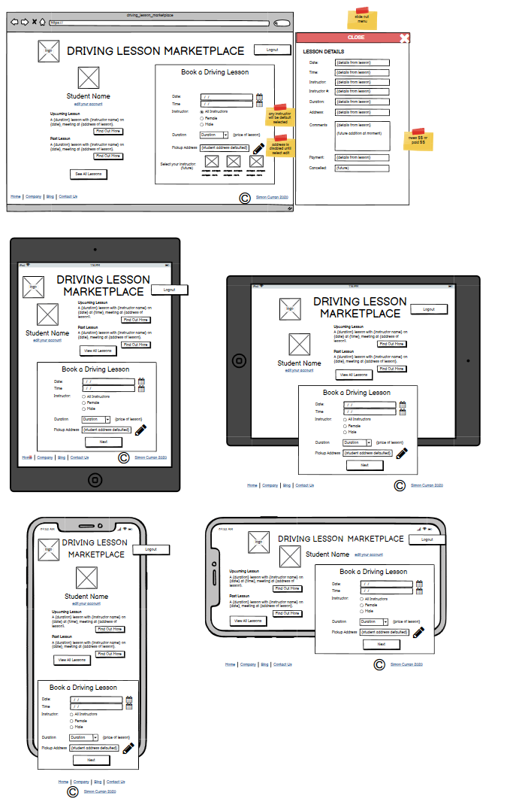
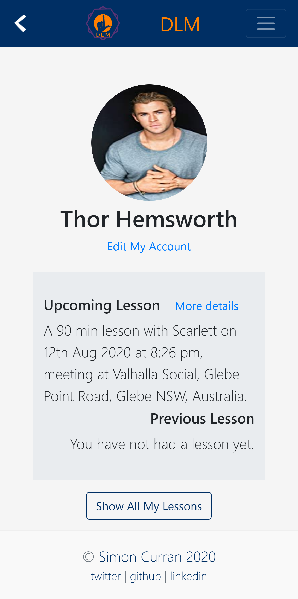

# SIMO_SULTAN'S DRIVING LESSONS MARKETPLACE

The app: [DLM](https://driving-lesson-marketplace.herokuapp.com/)  
Source code: [https://github.com/SimoSultan/dlm](https://github.com/SimoSultan/dlm)


#### Index:
- [**Statement of Purpose**](#Statement-of-Purpose)
- [**Problem and Solution**](#The-Problem-and-Solution)
- [**Target Audience**](#Target-Audience)
- [**Features**](#Features)
- [**Tech Stack**](#Tech-Stack)
- [**Implementation Plan**](#Implementation-Plan)
- [**User Stories**](#User-Stories)
- [**Sitemap**](#Sitemap)
- [**Trello**](#Trello-Board)
- [**Third Party Services**](#Third-Party-Services)
- [**Wireframes**](#Wireframes)
- [**Screenshots**](#Screenshots)
- [**Presentation**](#Presentation)
- [**Database Structure**](#Database-Structure)
- [**Development Log**](#Development-Log)
- [**Testing**](#Testing)
- [**Resources**](#Resources)
- [**Copyright**](#Copyright)


---

## Statement of Purpose

This is my first Ruby on Rails application. Currently studying at [Coder Academy](https://coderacademy.edu.au) and we were tasked with building a 2-way marketplace application and were given 10 days to complete this piece of assessment. This application is intended to be used by Learner Drivers and Instructors. A learner driver can sign up and book a lesson with an instructor and then are able to see all their lessons in the 'My Lessons' tab. Instructors and Admin roles can book lessons for students as well. Both instructors and students can see all of the upcoming and their past lessons for reference. Only people who have signed up to the app can utilise its full potential.

This application is the MVP for a full-fledged marketplace.

---

## The Problem and Solution

In one of my past professions I was a driver trainer. We are typically contractors who work for a company, and as we may not be busy all the time, especially in the middle of weekday, we may have a lot of spare time. So, as being a contractor allows us to work for anyone, we would be able to offer our services to other students to expand our reach and hopefully fill up our calendar more, but finding those students by oneself can be hard. So, a 2 way marketplace app can sit in this niche. It would allow a person to register on the app, and select available times for themselves to work (like an Uber driver), so they are available for students who use that app as well. This would allow them to stay busy and earn more money when they may not get work from their own company. 


A platform like this could actually exist in today's society and I intend to develop this idea further. I originally had built a page driving lesson booking system for my own company with JavaScript and Firebase. So my inspiration came from that app that could be expanded to a wider reach then. 

---


## Target Audience

The target audience for this app is for driving instructors and people looking to learn to drive.

---

## Features	

### Current features:  

- people must be authenticated before using the app (provided by Devise gem, seen in [Resources](#Resources))
- authorization of pages for certain roles (using CanCan gem, seen in [Resources](#Resources))

- students can sign up, view and edit the profile
- once completing their profile, a student can book a lesson
- students can see all of their upcoming and past lessons
- students can see their next and most recent lesson
- students can delete all their information and related lessons from the app

- instructors can sign up, view and edit the profile
- instructors can book a lesson for a student
- instructors can see and cancel any lesson
- instructors can delete all their information and related lessons from the app

- admin roles, which cannot be signed up for, but created by another admin, can see and edit their profile
- admins can create other admins
- admins can book a lesson for any student and any instructor
- admins can remove any person from the application
- admins can delete all their information from the app

### Future features:

- instructors will have their own calendar which is used to see if an instructor is free when a student books their lesson
- students can pay for their lessons via stripe
- students and instructors will be able to make comments about a lesson on the respective lesson
- more features for admin to edit and create new lesson lengths and costs
- when a person signs up they will need to confirm their email address
- instructors will be able to see a tally of their total lessons and total moneys earnt over lifetime and week by week
- instructors will be verified by a correct driver trainer license number
- students will be able to book a driving test to use the instructor's car
- students will be able to filter their lessons
- utilise cookies so that people don't have to keep logging in from their same computer


---


## Tech Stack

- Ruby
- Rails 6+
- HTML
- CSS
- SASS
- JavaScript and 
- PostgreSQL
- Git
- Bootstrap 4
- Heroku

Ruby on Rails was the foundation of this application which uses all of the above languages. There was additional JS written to implement the Google Maps Places API address autocomplete select box. Bootstrap was used for the front-end framework to style elements. PostgreSQL for the database. Git and GitHub for version control and Heroku for deployment.


---


## Implementation Plan

> ### User Stories

Only people who have signed up to the app can utilise its full potential. Otherwise they will only see the home page with sign up and log in links.
There will be 3 different types (roles) of people who will use the app. They are: Student, Instructor and an Admin role. 
All roles will be able to sign up, see their profile page, edit their personal information, change their password and delete their account.
Certain roles will only have access to certain information.  
*Any student/instructor can book a lesson with any instructor/student at this time. I am aware that this is not practical in real life, as what really needs to happen is a request to be sent to that person and then they can confirm that request. Especially from the side of instructors booking a lesson with a student. Not so much student to instructor, as if they were currently available then they would want that lesson to be booked immediately.*

#### Students

- A student who is old enough to start learning by QLD law, and someone who isn't. Server side validation will check the age of a user on profile creation. *(just realised that validation only occurs after a user is created, meaning there will be users on the users table who will never be able to sign up, or at least until they turn of age. I should add date of birth on user sign up to check it then. future update, not something to do 1 night before assessment is due)*.
- When signed up that student will be sent to the profile page to continue updating their profile.
- If that person does not complete their details and try to book a lesson, they will receive an error prompting them to complete their registration.
- For students who have complete profile information can now book a lesson with an instructor of their choice
  - There is a form on their profile page that allows them to do this.
- Students who do or do not have any lessons can click on their 'My Lessons' tab in the nav bar and can see any lessons they may or may not have, and are given a note on the page if they do not have any lessons booked.
- On their 'My Lessons' page, there is a 'Book A Lesson' button that will take them to a page where they are shown the same form from their profile page so that they can book a lesson.
- On the student's profile page, it will also show the student their upcoming and most recent lesson as well.

- A student who isn't old enough to sign up to the app, they will be presented with an error informing them they have to be of 16 years old before they can sign up and book a lesson.

#### Instructors

- An instructor who is old enough to teach learner drivers legally, according to QLD law, will be able to sign up and use the app. *(I have not included their QLD license numbers as I did not wish to validate that number with QLD Department of Transport for this MVP)*. They will be taken to their edit profile page where they are to fill in their personal information. There is server side validation to check the age of a user on profile creation.
- If that person does not complete their details and try to book a lesson, they will receive an error prompting them to complete their registration.
- For instructors who have complete profile information can now book a lesson with an student of their choice. *See note at top regarding this impractical approach*
- Instructors can see all their lessons in their 'My Lesson' tab as well, and will be shown their upcoming and most recent lesson on their profile page. 
- *I would have preferred to develop a solution where instructors will see all their upcoming lessons on that day on their profile page, but did not due to time constraints.*

- An instructor who isn't old enough to legally teach according to QLD law will not be able to sign up and use the app and will receive an error message as well, taking them back to their home page.

#### Admins

- An Admin is a person who works for DLM.
- They will have the ability to see and manage (i.e. create, see, update an delete) everything on the site. That is all users, students, instructors, admins and lessons. 
- In the future they will have the opportunity to add, edit and delete different lesson lengths and costs as well. 
- Admins can book a lesson for an instructor and student, but are not included in any of the dropdowns themselves.


> ### Sitemap
- [DLM Sitemap](https://app.lucidchart.com/documents/edit/f1969e48-fb25-4148-b36b-a8c9a932da01/0_0)  


#### Original Sitemap
The original sitemap was a great start to how to navigate through the app. But was unaware of how many more pages there would be. A 'back' button has been implemented and a nav menu so that each person can get to any page they have available to them. Original sitemap is seen below.


#### Updated Sitemap
The new sitemap includes all the extra pages that were included in the app. As can be seen, many more admin pages have been added. However a lot of pages are built from partials or are filtered versions of the original page. 


> ### Trello Board 

The project management application used to complete these tasks was Trello. Which allowed me to develop outlines for the majority of the application, including features, methods, timelines, user stories, bugs and so forth. A development log was kept alongside Trello to track daily progress. 

- [DLM Trello Board](https://trello.com/b/JUx9nN3o/driving-app)  
  


### Third Party Services

#### Bootstrap 4
Bootstrap 4 was chosen for the front-end framework due to its popularity in web developer scene. Personally wanted to take the opportunity to familiarize myself with its grid system a little better. A front-end framework was used due to the sheer help it provides in making a website responsive. It allows a lot quicker creation and adjustment of content on the page. 

#### PostgreSQL
The relational SQL database Postgres was required for our application. The database holds all our information which Rails uses to query to then return the respective information back to the user.

#### Heroku
Heroku was chosen for the method of deployment as it was recommended. Previously have used Netlify so it was good to experience another. Heroku has the ability for us to use its console for our own custom queries and it can be built to be deployed from the console. Providing logs to the developer if something goes wrong as to check where the error is coming from as well.

#### Amazon S3
S3 is used in DLM for the storage of the avatars for the profiles on the page. Storing photos locally could be an option, but quickly our app size will get extremely large, so a separate place to store the images was of great need. S3 is a popular choice for this due to its simplicity. It stores and send our images back with ease and integrated nicely with Rails.

#### Google Maps Places (autocompleted addresses)
Google Maps Places API was used as an additional service to provide the user a correct address that is formatted in a way for the server to handle it. If the user did not choose the dropdown address then server side validation will ensure that it is correct before submitting. 


> ### Wireframes

With my wireframes, I hadn't understood what I was and was not able to do, 1. in the time frame, and 2. how rails and some gems worked that would affect views. I will detail in each section where the wireframes differ from production. 

- [Balsamiq Wireframes File](./wireframes/driving_lesson_marketplace.bmpr)


#### Student Wireframes

##### Student Profile Page
It's similar, but the main difference is in the new lesson form and lack of slideout menu again. And the layout regarding the new lesson form doesn't move around like originally planned. It always sits underneath itself.


##### Student Edit Profile Page
Stayed the same.


##### Student Sign-up Page
Stayed the same.


##### Student All Lesson Page
Didn't get the search and filter functions onto MVP. And doesn't include the slideout modal.


#### Instructor Wireframes

##### Instructor Profile Page
Only showing instructor's upcoming and previous lesson. Didn't implement the feature where it shows a table of all upcoming lessons for that day. Also don't have counts running for the amount of lessons the instructor has completed and so forth.


##### Instructor Edit Profile Page
Stayed the same.  


##### Instructor Sign-up Page
Stayed the same.  


##### Instructor All Lesson Page
Didn't get the search and filter functions onto MVP. And doesn't include the slideout modal.


#### Other Wireframes

##### Home Page 
Was to have sign-up and log-in buttons that turned into a sign-up or log-in form. However, only buttons were included to go to separate sign up and log in pages due to Devise supplying them.


##### 404 Page 
Was found from a nice template online. This page didn't have an exact design.


##### Forgot Password Page 
Stayed the same.


> ### Screenshots

Here are the screenshots from the mobile view from the student's perspective, with one desktop view of admin. The instructor's pages are similar to this which is why they haven't been included. The desktop view of admin provides us with a look at how the app looks there.

***Disclaimer: All data seen below in screenshots is fake.***

##### Home Page


##### Signup Page


##### Login Page


##### Forgot Password Page


##### Student Profile Page


##### Student Edit Profile Page


##### Student Edit Account Page


##### Student All Lessons Page


##### Student New Lesson Page


##### Student View Lesson Page


##### Admin All Students/Instructors/Admin/Users/Lessons Page


> ### Presentation

Here is a link to my [Google Slides Presentation](https://docs.google.com/presentation/d/1eogqfMuEI7aU3tamuzeD5aQIzG-SiKWQFydJYUXe2XI/edit#slide=id.g35f391192_00) that we present the day after submission to the Brisbane cohort.


---


## Database Structure

### Entity Relationship Diagram
DbDesigner was chosen this time instead of DbDiagram to implement the ERD. However, I wish that I had used DbDiagram as Designer does not show the relationships at all, which is why they are seen in the note on the side. 

- [Link to my original ERD](https://app.dbdesigner.net/designer/schema/343185)  


- My auto-generated ERD from my models (created by the Gem [Rails ERD](https://github.com/voormedia/rails-erds)). As can be seen it is quite similar, missing the Calendar and Comment models, but also including the Active Storage models. Initial planning of the ERD paid off.


### Database Relations Discussion

#### High-level components in the app

##### Authentication and Authorisation component
General users will only be able to see the home page. They won't be able to use any of the features due to the nature of the app. It can be referred back to Uber, where a user must be signed up and can request a ride and a driver accepts it,. DLM is similar, *it's just that the Instructor is not accepting the request yet.* So Devise and CanCan are used to achieve this goal in restricting access to the database through their use. 

##### Student/Instructor/Admin Booking A Lesson
All of these roles can create a lesson. These lessons are associated with both the Student and an Instructor but are not associated with the Admin if they created it, *(which was a mistake now that I write this)*. Meaning all the relevant people will be able to see their respective authorized information.

##### Google Maps Autocomplete
Google Maps autocomplete allows the user to select their address from the dropdown. It provides a complete address to the server which can be validated and found in the future when linking that address back to Google Maps for directions. 

##### Instructors Editing Lessons
Instructors should be able to edit the information and control their schedule, whatever that is associated with them. Meaning they can cancel/uncancel, and edit time, address and duration of the lesson should they need to. 

##### Admin Management of Users and Details
Admins should be able to manage all users and objects on the database. They have complete control. These are trusted representatives of DLM who would have this role. 

#### Current Project Model and Database Relationships

##### User
- This model is set up by [Devise](https://github.com/heartcombo/devise) upon installation. The main information it holds is email, passwords and role information on the model. It also holds more information regarding resetting password which is utilized when a user needs to reset their password. The relationships of this model are below:
  - **has one Student**
  - **has one Instructor**
  - **has one Admin**
- Enums are used to convert the role:integer into our readable roles.
  - ```ruby enum role: {student: 0, instructor: 1, admin: 2} ```

##### Student
- This model was created with a rails scaffold. However, our relations are of course needed to be added in. We want the student to belong to the user profile, and for that student to then have many lessons associated with it. The relationships of this model are below:
  - **belongs to User**
  - **has one attached Avatar** (using Active Storage and Amazon S3)
  - **has many Lessons**
- Enums were used on this model for the transmission:integer, converting them to human readable again.
  - ```ruby enum transmission: {manual: 0, automatic: 1} ```

##### Instructor
- This model was also created with a rails scaffold. The Instructor has the same relationship structure as a Student, as it will belong to the user profile, and then have many lessons associated with it as well. The relationships of this model are below:
  - **belongs to User**
  - **has one attached Avatar** (using Active Storage and Amazon S3)
  - **has many Lessons**
- Enums were used on this model for the transmission:integer, and the gender:integer, converting them to human readable again. Gender was used for the instructor to able to be incorporated in at a later stage that when a student selects a male/female/any instructor, the appropriate instructors will be available to them in the dropdown menu on the new lesson form. 
  - ```ruby enum transmission: {manual: 0, automatic: 1} ```
  - ```ruby enum gender: {male: 0, female: 1} ```

##### Admin
- As an Admin can't have any lessons, it only needs to be linked to our user and also have an avatar available to them if they wish. The relationships of this model are below:
  - **belongs to User**
  - **has one attached Avatar** (using Active Storage and Amazon S3)

##### Lesson
- Lesson model will belong to the people that are associated with it. Meaning, only the Student and Instructor. Now thinking about it, it would be good to have an association to an Admin if they create a lesson as well. *(future update)*.  The relationships of this model are below:
  - **belongs to Student**
  - **belongs to Instructor**

##### Future Models to be implemented
- LessonInfo model will contain the cost and duration of lessons that can be created, updated and deleted by the Admin role. There would not be a relation in this model as we are only fetching information from it. 
- Payments will contain the payment information that will **belongs to** a lesson. Lesson would have a **has one** relation.
- Comment model would be used to allow a comment and review feature on the lessons. An instructor would be able to give the student their feedback for the lesson on there. It would store the information of our users, the lesson, and the text for of the comment. 
- Calendar to the instructor so that instructors can fill out their available times which then directly affect if a lesson can be book or not with that instructor. That is, if the instructor is not available at that time, then the lesson cannot be booked and user receives an error. Instructors will **have one** calendar, which in turn **belongs to** the instructor.


### Schema Design
Below is code found in the DLM schema file to show how it works at a glance.

```ruby

ActiveRecord::Schema.define(version: 2020_08_04_005750) do

  # These are extensions that must be enabled in order to support this database
  enable_extension "plpgsql"

  create_table "active_storage_attachments", force: :cascade do |t|
    t.string "name", null: false
    t.string "record_type", null: false
    t.bigint "record_id", null: false
    t.bigint "blob_id", null: false
    t.datetime "created_at", null: false
    t.index ["blob_id"], name: "index_active_storage_attachments_on_blob_id"
    t.index ["record_type", "record_id", "name", "blob_id"], name: "index_active_storage_attachments_uniqueness", unique: true
  end

  create_table "active_storage_blobs", force: :cascade do |t|
    t.string "key", null: false
    t.string "filename", null: false
    t.string "content_type"
    t.text "metadata"
    t.bigint "byte_size", null: false
    t.string "checksum", null: false
    t.datetime "created_at", null: false
    t.index ["key"], name: "index_active_storage_blobs_on_key", unique: true
  end

  create_table "admins", force: :cascade do |t|
    t.bigint "user_id", null: false
    t.string "first_name"
    t.string "last_name"
    t.datetime "created_at", precision: 6, null: false
    t.datetime "updated_at", precision: 6, null: false
    t.index ["user_id"], name: "index_admins_on_user_id"
  end

  create_table "instructors", force: :cascade do |t|
    t.bigint "user_id", null: false
    t.string "first_name"
    t.string "last_name"
    t.string "address"
    t.string "phone"
    t.string "dob"
    t.integer "transmission"
    t.integer "gender"
    t.datetime "created_at", precision: 6, null: false
    t.datetime "updated_at", precision: 6, null: false
    t.index ["user_id"], name: "index_instructors_on_user_id"
  end

  create_table "lesson_infos", force: :cascade do |t|
    t.integer "cost"
    t.integer "duration"
    t.datetime "created_at", precision: 6, null: false
    t.datetime "updated_at", precision: 6, null: false
  end

  create_table "lessons", force: :cascade do |t|
    t.bigint "student_id", null: false
    t.bigint "instructor_id", null: false
    t.date "date"
    t.time "time"
    t.integer "duration"
    t.boolean "cancelled"
    t.datetime "created_at", precision: 6, null: false
    t.datetime "updated_at", precision: 6, null: false
    t.index ["instructor_id"], name: "index_lessons_on_instructor_id"
    t.index ["student_id"], name: "index_lessons_on_student_id"
  end

  create_table "payments", force: :cascade do |t|
    t.bigint "user_id", null: false
    t.bigint "lesson_id", null: false
    t.string "card_no"
    t.string "exp"
    t.integer "amount"
    t.datetime "created_at", precision: 6, null: false
    t.datetime "updated_at", precision: 6, null: false
    t.index ["lesson_id"], name: "index_payments_on_lesson_id"
    t.index ["user_id"], name: "index_payments_on_user_id"
  end

  create_table "students", force: :cascade do |t|
    t.bigint "user_id", null: false
    t.string "first_name"
    t.string "last_name"
    t.string "address"
    t.string "phone"
    t.string "dob"
    t.integer "transmission"
    t.datetime "created_at", precision: 6, null: false
    t.datetime "updated_at", precision: 6, null: false
    t.index ["user_id"], name: "index_students_on_user_id"
  end

  create_table "users", force: :cascade do |t|
    t.string "email", default: "", null: false
    t.string "encrypted_password", default: "", null: false
    t.string "reset_password_token"
    t.datetime "reset_password_sent_at"
    t.datetime "remember_created_at"
    t.datetime "created_at", precision: 6, null: false
    t.datetime "updated_at", precision: 6, null: false
    t.integer "role"
    t.index ["email"], name: "index_users_on_email", unique: true
    t.index ["reset_password_token"], name: "index_users_on_reset_password_token", unique: true
  end

  add_foreign_key "active_storage_attachments", "active_storage_blobs", column: "blob_id"
  add_foreign_key "admins", "users"
  add_foreign_key "instructors", "users"
  add_foreign_key "lessons", "instructors"
  add_foreign_key "lessons", "students"
  add_foreign_key "payments", "lessons"
  add_foreign_key "payments", "users"
  add_foreign_key "students", "users"
end


```

---

## Development Log

- [Development log](./development-log.md)


---

## Testing

Only manual testing was undertaken for this assignment due to time restraints to implement automatic testing which is something I really wish I had more time to look into. Manual tests that were undertaken were any time a new feature was implemented. For example the tests that were run;
- rails app generation
- implementing bootstrap
- deploying to heroku
- implementing devise signup/login authentication gem
- rails generation of scaffold pages
- reading and displaying data pulled from the database
- creation of new data into the database
- updating data in database
- destroying data in database
- implementing enums for different roles for users
- implementing partials and dryer/dynamic views
- implementing cancan authorization of different data being available for different roles/users
- seeding the database
- full styling of app
- implementing Amazon S3 image upload for avatar photos
- attaching images to specific roles (i.e. students/instructors/admins)

Manual testing takes up a lot of time, especially when it's a trial and error method. In the end, investing the time to understand how you will test throughout the app, and create these tests in the beginning would have been highly advantageous for speeding up testing processes. 


---


## Resources

- Amazon S3 was used for profile image upload
- Google Maps Places API for the Google address select box
- Bootstrap 4 was used for front-end framework
- Git and GitHub for version control
- Heroku for deployment

### Gems Used
- [Devise](https://github.com/heartcombo/devise)
  - for user authentication
- [AWS SDK S3](https://github.com/aws/aws-sdk-ruby)
  - for image upload
- Gravatar image tag in Gemfile is not being used yet
- [CanCan](https://github.com/ryanb/cancan)
  - for user authorisation
- Inline SVG in Gemfile is not being used yet
- [Faker](https://github.com/faker-ruby/faker)
  - to build fake names on database in seeds.rb
- [Bullet](https://github.com/flyerhzm/bullet)
  - to check eager loading in development environment
- [Stimulus](https://github.com/stimulusjs/stimulus)
  - used when building the Google Maps autocomplete dropdown.
- [Rails ERD](https://github.com/voormedia/rails-erds)
  - used to generate an ERD of current model relationships.

### Icons
- [Capicon](https://mariodelvalle.github.io/CaptainIconWeb/)
  - not currently being used but will implement in future update

### Images
- [Logomakr](https://logomakr.com/9dzQOD)
  - for my logo...
- [Lesson Background Image](https://unsplash.com/photos/Kuu5mmxkwW4)
  - used on the lesson show page

### Page Templates
- [404 Page](https://codepen.io/sqfreakz/pen/GJRJOY)
  - 404 page...


---


## Copyright

MIT License

Copyright (c) 2020 Simon Curran

Permission is hereby granted, free of charge, to any person obtaining a copy
of this software and associated documentation files (the "Software"), to deal
in the Software without restriction, including without limitation the rights
to use, copy, modify, merge, publish, distribute, sublicense, and/or sell
copies of the Software, and to permit persons to whom the Software is
furnished to do so, subject to the following conditions:

The above copyright notice and this permission notice shall be included in all
copies or substantial portions of the Software.

THE SOFTWARE IS PROVIDED "AS IS", WITHOUT WARRANTY OF ANY KIND, EXPRESS OR
IMPLIED, INCLUDING BUT NOT LIMITED TO THE WARRANTIES OF MERCHANTABILITY,
FITNESS FOR A PARTICULAR PURPOSE AND NONINFRINGEMENT. IN NO EVENT SHALL THE
AUTHORS OR COPYRIGHT HOLDERS BE LIABLE FOR ANY CLAIM, DAMAGES OR OTHER
LIABILITY, WHETHER IN AN ACTION OF CONTRACT, TORT OR OTHERWISE, ARISING FROM,
OUT OF OR IN CONNECTION WITH THE SOFTWARE OR THE USE OR OTHER DEALINGS IN THE
SOFTWARE.


--- 


## Author
© Simon Curran  
[www.simonmcurran.com](https://www.simonmcurran.com/)